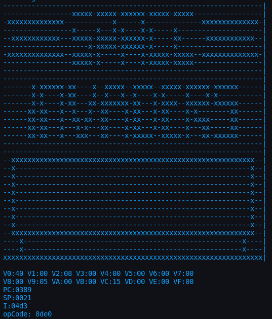

## A CHIP8 emulator/interpreter in C++

```
CHIP-8 is an interpreted programming language, developed by Joseph Weisbecker. It was initially used on the COSMAC VIP and Telmac 1800 8-bit microcomputers in the mid-1970s. CHIP-8 programs are run on a CHIP-8 virtual machine. It was made to allow video games to be more easily programmed for these computers.
```

#### Build
```
mkdir -p ./bin && g++ -pedantic -Wall -g -std=c++14 ./src/main.cpp -o ./bin/main.bin
```

#### RUN
```
./bin/main.bin
```

#### OUTPUT

Currently the chip-8 video frame is visualized in ascii, followed by a printout of the registers after 1000 cpu cycles.



## Resources

- [http://www.cs.columbia.edu/~sedwards/classes/2016/4840-spring/designs/Chip8.pdf](http://www.cs.columbia.edu/~sedwards/classes/2016/4840-spring/designs/Chip8.pdf)
- [wikipedia.org/wiki/CHIP-8](https://en.wikipedia.org/wiki/CHIP-8#Opcode_table)
- [github.com/ismaelrh/Java-chip8-emulator](https://github.com/ismaelrh/Java-chip8-emulator/tree/6bbf5496e4f10bac47c4895dbe673a42a3548b9e)